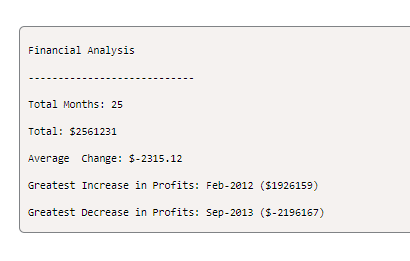

# Console-Finances

## About this project
To analyze the financial records of a company with a dataset composed of arrays with two fields: Date and Profit/Losses.

To calculate each of the following:

The total number of months included in the dataset. Done

The net total amount of Profit/Losses over the entire period. Done

The average of the changes in Profit/Losses over the entire period. Pending

Track what the total change in profits is from month to month and then find the average (Total/Number of months). Pending

The greatest increase in profits (date and amount) over the entire period. Pending

The greatest decrease in losses (date and amount) over the entire period. Pending

## Screenshot
The following shows the web applications mock up appearance I used to guide my current portfolio:

## Project Link
Application can can be viewed here: 
* [Live](https://tahminahannan.github.io/Console-Finances/)

* [Repository](https://github.com/TahminaHannan/Console-Finances)

## Built with:
* HTML
* Javascript
* Gitbash

## Tests
Tested the website functionality using:
* [w3 - Validator](https://validator.w3.org/nu/)

## Credits

## License
Distributed under the MIT License. See LICENSE.txt for more information.